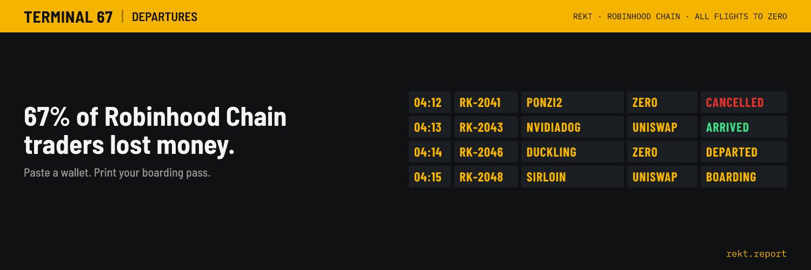
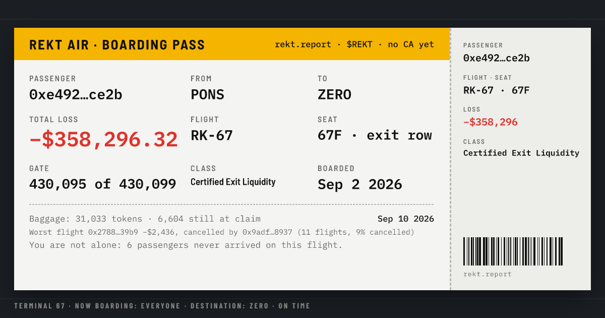
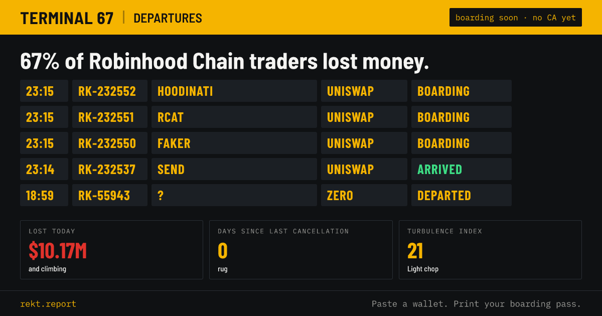
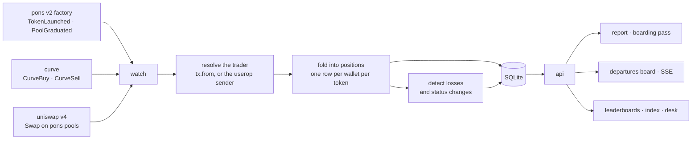

<div align="center">


# REKT

**the loss ledger of Robinhood Chain**<br>
paste any address · get your boarding pass to zero · every flight on one departures board<br>
no wallet · no signature · nothing to connect

<br>



<br>


<br>

**$REKT** · `0xa596071ff217204cdb74b2bd94ac8dd79ee97082`

<sub>This is the only $REKT contract. Every other address carrying this name is not ours.</sub>

<br>

[rekt.report](https://rekt.report) · [GitHub](https://github.com/0xChromium/Rekt) · [@0xchromium](https://x.com/0xchromium)

</div>

<br>

Two hundred thousand tokens launch on [pons](https://www.ponsfamily.com) in a week. **Nineteen in a
thousand** reach a Uniswap pool. Everything else is somebody's money, and the chain keeps a perfect
record of whose, which nobody reads.

REKT reads it. Every launch, every curve trade, every pool swap after graduation, folded into one
position per wallet per token, so that pasting an address returns what it actually cost you: the
total, the worst flight, who cancelled it, what you are still holding, and where you rank among
everyone else who boarded. It prints as a boarding pass, because a number nobody wants to see is
easier to look at when it comes with a seat assignment.



<sub>A real address, printed by the running site. Rank, class and seat come from the record; the
loss is average-cost realized PnL in dollars.</sub>

<br>

| | |
|---|---|
| **Two streams, not one** | curve trades (`CurveBuy`/`CurveSell`) and Uniswap v4 pool swaps. Pool swaps are about **70%** of all trading; a site that indexes only the curve shows an empty page to anyone who trades the tokens that made it |
| **The trader, not the router** | a swap event names the router, so the trader is the transaction sender. About **14%** of them arrive through an ERC-4337 bundler, and there the sender is the bundler, so the account behind the user operation is read out of the receipt |
| **Cost basis or nothing** | proceeds are scaled to the share of tokens we actually saw bought. A wallet that sold an airdrop is worth zero here, in either direction, rather than a fabricated profit |
| **The record says how deep it is** | `/api/health` publishes exactly how many days each stream covers, and the site prints it. A visitor whose flights are older is told so, in those words, instead of being shown a blank page |
| **No wallet, ever** | every page is a read. Nothing connects, nothing signs, and the machine serving this holds no key |

<br>



<br>

| What you would otherwise do by hand | What REKT does instead |
|---|---|
| open a block explorer and add up your own trades | one address in, one page out, with the worst flight named and the deployer who cancelled it |
| guess whether you did badly | ranks you against every wallet on record, and prints the rank on the pass |
| watch a launch feed that shows launches | shows the endings: cancelled, departed, arrived, with the loss attached to each |
| wonder if a dead token was a rug | reads the deployer's other launches and prints their cancellation rate |
| have no idea what today was like | a turbulence index from the day's losses and cancellations, with a label a person can read |
| find out a project's fee share by asking | a compensation desk page that reads the escrow on chain and shows what has accrued |

<br>

## How it works

One process follows the chain and one serves the site. They share a single SQLite file and nothing
else, which is the whole architecture.



A backward fill runs beside the watcher and walks the record towards the first Pons v2 block,
newest slices first, because the value of history falls off with age and every finished slice
immediately answers more addresses. Both processes write the same file at once, which SQLite allows
only because every transaction here opens with `BEGIN IMMEDIATE` and waits its turn.

<br>

## What the record says

Measured from the folded record, not from anywhere else. Numbers move; the queries do not.

| | |
|---|---|
| Launches read | 232,349 |
| Reached a Uniswap pool | 4,321, which is 1.9% |
| Wallets | 749,179 |
| Positions | 5,864,407 |
| Losses recorded | 1,719,097 |
| Wallets that closed a trade and were down on it | 62.1% |
| Lost by the wallets that lost | $85.1M |

<br>

## Running it

Node 22.13 or newer, because the runtime runs the TypeScript directly. There is no build step and
no bundler.

```bash
npm ci
cp .env.example .env
npm run doctor
```

`doctor` checks both endpoints, the chain id, every Pons address against the live factory's own
getters, and the database. Fix whatever it prints before going further.

Then fill a first window and start the two processes:

```bash
npm run backfill -- --hours 6     # launches
npm run fold -- --hours 6 --once  # curve trades into positions
npm run pools -- --init           # find the pools of graduated tokens
npm run pools -- --hours 6        # pool swaps into positions
npm run watch                     # follow the chain from here on
npm run api                       # the site, on PORT
```

`MOCK=1 npm run api` serves every page from the fixtures in `web/mock/` with no database at all,
which is enough to work on the front end.

<br>

## Commands

| | |
|---|---|
| `npm run watch` | follow the chain: launches, graduations, curve trades, pool swaps, statuses |
| `npm run api` | serve the site |
| `npm run backfill` | read factory logs over a window |
| `npm run fold` | fold curve trades into positions |
| `npm run pools` | fold pool swaps into positions; `--init` discovers pools first |
| `npm run names` | fill in tickers that the launch event did not carry |
| `npm run card` | render a boarding pass PNG for an address |
| `npm run brand` | render the logo and banner from the brand tokens |
| `npm run doctor` | check endpoints, addresses, config and storage |
| `npm run stats` | how many people came and what they used |
| `npm test` | the suite, offline, about six seconds |

<br>

## Where the fee goes

$REKT launches on Pons with a creator fee. **Half of everything it earns goes to holders who
stake**, on chain, through a splitter that anybody can trigger and nobody can redirect except the
factory owner, behind a three-day timelock.

That rule starts at one transaction: the block the splitter becomes the fee recipient on the Pons
factory. What the token earns before it goes to the fee wallet and pays for building this. The
compensation desk page reads the escrow directly, shows the balance either way, and shows holders
$0 owed for as long as the fee wallet is still the recipient, so the rule is checkable before it
starts rather than asserted after.

<br>

## Where it lets you down

- **Only Pons pools are indexed.** A wallet that traded the same token on another venue is invisible
  here, and will stay invisible. What is shown is Pons activity, not all activity.
- **The record is as deep as it has been filled.** It grows backwards towards 4 August on its own,
  and until it arrives an older wallet is told its flights predate the record. The exact depth is on
  `/api/health` and printed on the about page, so this is never a guess.
- **A position bought before the record and sold inside it has no cost basis.** Its proceeds are not
  counted as profit, which is right, but it means a heavy pre-record trader reads as quieter than
  they were. The count of such positions is shown on the report as `Carried on`.
- **Prices are the quote asset's, converted at a recent rate**, not the rate at the moment of each
  trade. Over a week this is close; over months it would not be.
- **Tickers come off the chain as the deployer typed them.** The board shows them unedited. The one
  exception is the shared link image, where a slur in a ticker would go into other people's feeds.

<br>

---

<br>

# Under the hood

Nothing below is needed to use the site.

## The pipeline

```
factory logs ─┐
curve logs   ─┼─▶ resolve trader ─▶ fold ─▶ positions ─▶ report · board · leaderboards
pool swaps   ─┘      (tx / userop)          (SQLite)
```

- **Ingest** (`src/ingest.ts`, `src/watch.ts`) follows the Pons v2 factory over websocket with
  polling as a fallback, and every path funnels through the same catch-up read, so a dropped socket,
  a missed notification and a restart all recover the same way.
- **Folding** (`src/fold.ts`, `src/poolfold.ts`) turns trades into one row per wallet per token.
  Positions are sums over disjoint block ranges, which is what makes the backward fill safe to run
  beside the live watcher.
- **Storage** (`src/db.ts`) is `node:sqlite`, so there is no native module to build. Exact amounts
  are stored as strings, floats alongside them for sorting.
- **Rendering** (`src/card.ts`, `src/ogcard.ts`) draws the boarding pass and the link preview with
  satori and resvg, from the same data the pages show.
- **The API** (`src/api.ts`) serves pages, JSON and one SSE stream, and answers every route from the
  database with short in-process caches.

## Four things that are easy to get wrong

Each of these produces a plausible, wrong answer with no error anywhere.

1. **Indexing only the curve.** Roughly 70% of trading happens in Uniswap pools after graduation. A
   report built from curve trades alone is empty for exactly the people who trade most, and it looks
   like a bug in the address rather than a gap in the index.
2. **Taking the swap's sender as the trader.** The event names the router. Reading `tx.from` fixes
   most of it, but about 14% of transactions come through an ERC-4337 EntryPoint, where `tx.from` is
   the bundler; those need the user operation's own sender or the trades land on service addresses.
3. **Counting proceeds without a cost basis.** Almost a quarter of positions were sold without a
   purchase inside the record. Counting the sale as pure profit put a wallet selling airdrops near
   the top of the leaderboard with half a million dollars it never made.
4. **Reading a rate limit as a range that is too wide.** A 429 and a "too many results" both say
   "too many"; answering the first by narrowing the range means sending more requests, which is
   exactly the wrong move, and the fill slows to a crawl without ever failing.

## Tests

```bash
npm test
```

Offline and deliberately narrow: they cover the places where a bug is silent rather than loud. The
realized-PnL formula and its missing-basis case, the pool swap sign convention and bundled senders,
the coverage counter that must never promise more depth than the record has, the transaction rule
that keeps two writers off each other, the board's status transitions, and every fixture against the
types the site is built on.

## License

MIT.
